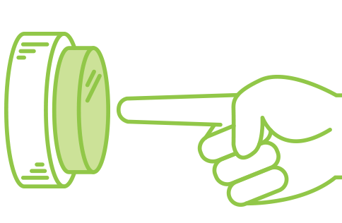

# EasyButton

[](https://gitter.im/thingsboard/chat?utm_source=badge&utm_medium=badge&utm_campaign=pr-badge&utm_content=badge)
[](https://travis-ci.org/thingsboard/thingsboard)
[](http://doge.mit-license.org)

Arduino library to debounce buttons, detect presses, releases, long presses and sequences



## What it is for

This library is for debouncing and reading momentary contact switches like tactile buttons. It uses callbacks to trigger actions when a Button is pressed once or held for a given duration. It also provides a sequence counter to be able to rise an event when a given pattern of presses has been matched.

## How to install

Install the library using one of the following options

- [Arduino Library Manager](https://www.arduino.cc/en/Guide/Libraries)
- [Clone this repository into your libraries directory](https://help.github.com/articles/cloning-a-repository/)
- [Use it locally cloning this repository into your project's directory](https://help.github.com/articles/cloning-a-repository/)

## How to use

#### Include the library

``` c++
#include <EasyButton.h>
```

#### Create the Button instance

Create an instance of `EasyButton` class for each button that you want to use, and pass the pin number as an argument. 

```c++
// Button instance
EasyButton button(BUTTON_PIN);
```

The class constructor takes the following additional arguments:

**dbTime** : Debounce time in milliseconds.

**puEnable** : Use or not the internal pullup resistor. Enabled by default.

**invert** : Inverts button's logic. If true, low = pressed else high = pressed.

```c++
// EasyButton class's constructor signature
EasyButton(uint8_t pin, uint32_t dbTime = 35, uint8_t puEnable = true, uint8_t invert = true)
```

#### Initialize Button Object

```c++
// Initialize Button Object
button.begin();
```

#### Continuously read the status of the Button

```c++
void loop() {
    // Continuously read the status of the button. 
    button.read();
}
```

#### Available methods in the library

- ###### onPressed

  Triggers a callback function when the Button has been pressed and released. The callback function will be called each time the Button is pressed.

  ```c++
  // Single pressed
  button.onPressed(onPressedCallback);
  ```

- ###### onPressedFor

  Triggers a callback function when the Button has been pressed and hold for at least the given duration time. This method takes two parameters as arguments. The first argument is the duration in milliseconds and the second is the callback function to be called.

  ```c++
  // Pressed for a duration
  int duration = 2000;
  button.onPressedFor(duration, onPressedCallback);
  ```

- ###### onSequence

  Triggers a callback function when the Button presses matches the given sequence pattern. This method takes three parameters as arguments. **The first argument** is the number of times to press the Button in order to trigger the sequence event. **The second argument** is the timeout in which the sequence has to reproduce in order to trigger the sequence event. **Third argument** is the callback function to be called.

  ```c++
  // Sequence of presses
  int number_of_presses = 5;	 	// Number of presses for the sequence
  int sequence_timeout = 2000;	// Sequence timeout
  button.onSequence(number_of_presses, sequence_timeout, onSequenceMatchedCallback);
  ```

#### Additional methods available

There some other methods available that might be useful for you in some scenarios. 

- ###### isPressed

  Returns true if the Button state was pressed at the last read.

  ```c++
  // isPressed
  bool pressed = button.isPressed();
  ```

- ###### isReleased

  Returns true if the Button state was released at the last read.

  ```c++
  // isReleased
  bool released = button.isReleased();
  ```

- ###### wasPressed

   Returns true if the Button state at the last read was pressed.

  ```c++
  // wasPressed
  bool was_pressed = button.wasPressed();
  ```

- ###### wasReleased

  Returns true if the Button state at the last read was released.

  ```c++
  // wasReleased
  bool was_released = button.wasReleased();
  ```

- ###### pressedFor

  Returns true if the Button state at the last read was pressed, and has been in that state for at least the given number of milliseconds.

  ```c++
  // pressedFor
  int pressedForTime = 2000;
  bool pressed_for = button.pressedFor(pressedForTime);
  ```

- ###### releasedFor

  Returns true if the Button state at the last read was released, and has been in that state for at least the given number of milliseconds.

  ```c++
  // releasedFor
  int releasedForTime = 2000;
  bool released_for = button.releasedFor(releasedForTime);
  ```

  #### Examples

  [Pressed](https://github.com/evert-arias/EasyButton/blob/master/examples/Pressed/Pressed.ino)

  [PressedForDuration](https://github.com/evert-arias/EasyButton/blob/master/examples/PressedForDuration/PressedForDuration.ino)

  [Sequence](https://github.com/evert-arias/EasyButton/blob/master/examples/Sequence/Sequence.ino)

## Copyright

[MIT](../LICENSE.md) © [Evert Arias](https://evert-arias.github.io/)